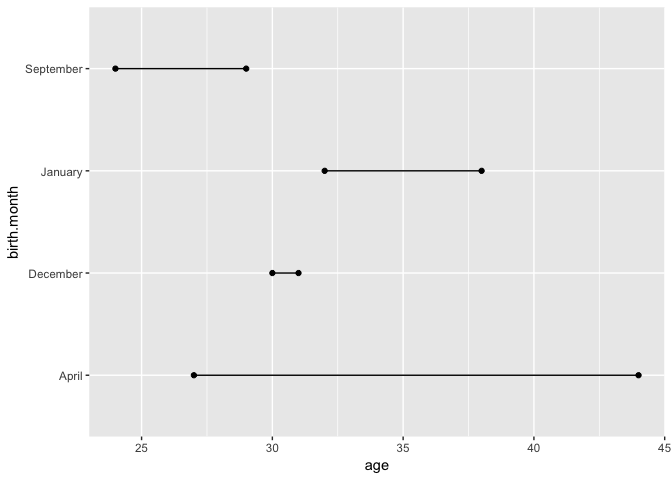
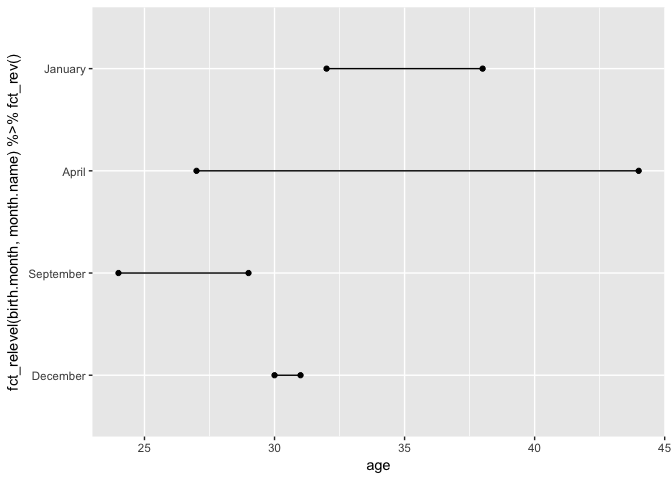
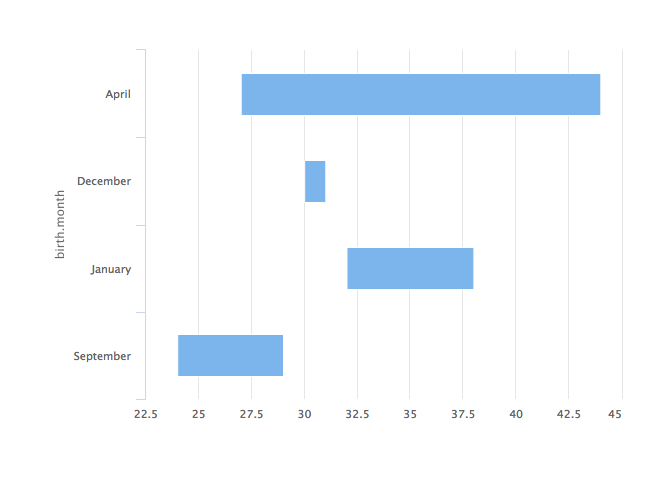
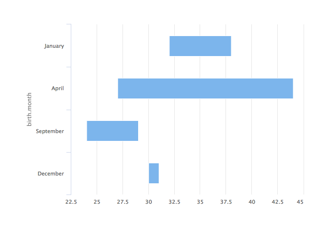

<!-- README.md is generated from README.Rmd. Please edit that file -->

# Birthday Factors

This is a tiny example dataset to demonstrate the importance of factors
to chart design.

There’s a very simple dataset in this project which contains the birth
month and age of 8 people:

``` r
library("tidyverse")
birthdays <- read_csv("data/birthdays.csv")
birthdays
#> # A tibble: 8 x 3
#>   name    birth.month   age
#>   <chr>   <chr>       <int>
#> 1 Riley   December       30
#> 2 Taylor  September      29
#> 3 Jo      September      24
#> 4 Elliott December       31
#> 5 Charlie January        38
#> 6 Sean    January        32
#> 7 Sam     April          27
#> 8 Alex    April          44
```

We’re interested in visualising the age ranges of humans within each
month. The months have deliverately been put out of order to show how
different packages treat factors.

The `forcats` library is part of the `tidyverse` and radically improves
the ease with which factors can be worked with.

# ggplot2

## No factor provided

`ggplot2` orders the birth months according to where they first appear
in the column, the same order returned by
`unique(birthdays$birth.month)`

``` r
birthdays %>%
  ggplot(aes(x = birth.month, 
             y = age)) +
  geom_line() + 
  geom_point() +
  coord_flip()
```

<!-- -->

## Using factors

We’re able to use the `forcats` functions directly within `aes` to
specify the order of our levels. Note that `coord_flip()` reverses the
y-axis, hence the use of `fct_rev()`.

``` r
birthdays %>%
  ggplot(aes(
    x = fct_relevel(
      birth.month,
      month.name
    ) %>%
      fct_rev(),
    y = age
  )) +
  geom_line() +
  geom_point() +
  coord_flip()
```

<!-- -->

`fct_relevel` is noisy about missing levels, use `suppressWarnings()` to
remove these warnings.

# highcharter

## No factor provided

First let’s construct a dataset that’s the right shape to create a
`columnrange` chart:

``` r
age_ranges <- birthdays %>%
  group_by(birth.month) %>%
  summarise(max.age = max(age),
            min.age = min(age))
```

`highcharter` orders the birth months in the order in which they appear
in the `tibble`:

``` r
library("highcharter")

age_ranges %>%
  hchart(
    type = "columnrange",
    hcaes(
      x = birth.month,
      low = min.age,
      high = max.age
    ),
    inverted = TRUE
  ) %>%
  hc_chart(inverted = TRUE) %>%
  hc_plotOptions(series = list(animation = FALSE))
```

<!-- -->

## Using factors

Again, create data shaped appropriately for a `columrange` chart:

``` r
age_ranges <- birthdays %>%
  group_by(birth.month) %>%
  summarise(max.age = max(age),
            min.age = min(age))
```

Specifying the column as a factor does nothing:

``` r
age_ranges %>%
  mutate(birth.month = fct_relevel(
      birth.month,
      month.name
    )) %>%
  hchart(
    type = "columnrange",
    hcaes(
      x = birth.month,
      low = min.age,
      high = max.age
    ),
    inverted = TRUE
  ) %>%
  hc_chart(inverted = TRUE) %>%
  hc_plotOptions(series = list(animation = FALSE))
```

<!-- -->

Instead, we must order the rows of our `tibble` according to the
ordering of the factor:

``` r
age_ranges %>%
  mutate(birth.month = fct_relevel(
      birth.month,
      month.name
    )) %>%
  mutate(month.ordering = order(birth.month)) %>%
  arrange(desc(month.ordering)) %>%
  hchart(
    type = "columnrange",
    hcaes(
      x = birth.month,
      low = min.age,
      high = max.age
    ),
    inverted = TRUE
  ) %>%
  hc_chart(inverted = TRUE) %>%
  hc_plotOptions(series = list(animation = FALSE))
```

<!-- -->

We can prove to ourselves that this is all that’s necessary and factors
aren’t required as follows

``` r
age_ranges %>%
  mutate(month.ordering = c(3, 1, 4, 2)) %>%
  arrange(desc(month.ordering)) %>%
  hchart(
    type = "columnrange",
    hcaes(
      x = birth.month,
      low = min.age,
      high = max.age
    ),
    inverted = TRUE
  ) %>%
  hc_chart(inverted = TRUE) %>%
  hc_plotOptions(series = list(animation = FALSE))
```

<!-- -->
